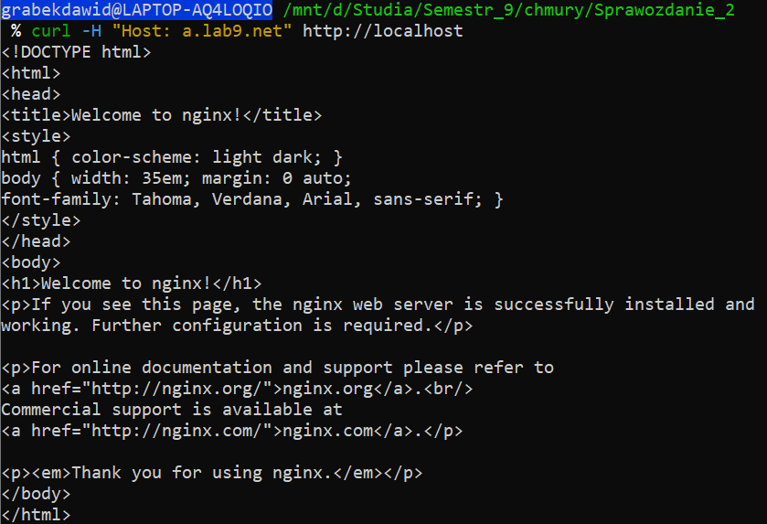
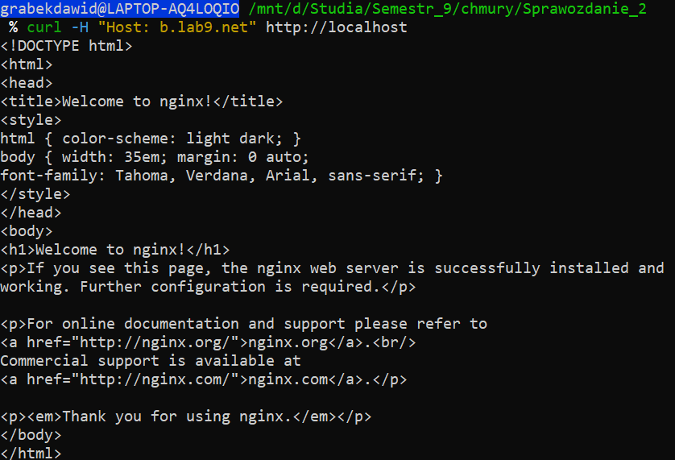
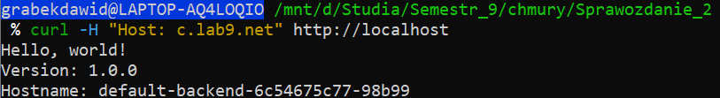

# Sprawozdanie lab9

## Pliki konfiguracyjne

### Deployments

- **Plik:** `app-a-deployment.yaml`

  - Zawiera konfigurację Deploymentu dla aplikacji `app-a`. Deployment tworzy dwa pody w przestrzeni `appns-a` na bazie obrazu NGINX.

- **Plik:** `app-b-deployment.yaml`
  - Podobnie jak w przypadku `app-a`, Deployment dla `app-b` tworzy dwa pody w przestrzeni `appns-b` na bazie obrazu NGINX.
- **Plik:** `default-backend.yaml`
  - Deployment i **serwis** dla domyślnego backendu, który obsługuje ruch niezmatchowany przez reguły Ingress. Backend wykorzystuje aplikację `hello-app`.

### Services

- **Plik:** `services-a-b.yaml`
  - Definiuje serwisy dla `app-a` i `app-b`.
  - Serwisy typu `ClusterIP` zapewniają komunikację z podami na porcie 80 w ramach przestrzeni nazw.
- **Plik:** `default-backend.yaml`
  - Deployment i **serwis** dla domyślnego backendu, który obsługuje ruch niezmatchowany przez reguły Ingress. Backend wykorzystuje aplikację `hello-app`.

### Ingress

- **Plik:** `ingress-a.yaml`
  - Konfiguruje dostęp do `app-a` pod adresem `a.lab9.net`. Ruch HTTP jest kierowany na serwis `app-a-service`.
- **Plik:** `ingress-b.yaml`
  - Konfiguruje dostęp do `app-b` pod adresem `b.lab9.net`. Ruch HTTP jest kierowany na serwis `app-b-service`.
- **Plik:** `ingress-default.yaml`
  - Konfiguruje domyślny backend, który obsługuje żądania niepasujące do reguł w `ingress-a.yaml` i `ingress-b.yaml`.

### NetworkPolicy

- **Plik:** `network-policy.yaml`
  - Zawiera definicje polityk sieciowych:
    - Blokuje ruch między przestrzeniami nazw `appns-a` i `appns-b`.
    - Zezwala na ruch przychodzący z przestrzeni nazw `ingress-nginx`, umożliwiając Ingress Controller dostęp do aplikacji.

## Kroki wykonania

1.  **Wdrożenie aplikacji:**

    - Zastosowano pliki `app-a-deployment.yaml`, `app-b-deployment.yaml` i `default-backend.yaml`:

      ```bash
      kubectl apply -f app-a-deployment.yaml
      kubectl apply -f app-b-deployment.yaml
      kubectl apply -f default-backend.yaml
      ```

2.  **Utworzenie serwisów:**

    - Zastosowano `services-a-b.yaml`:

      ```bash
      kubectl apply -f services-a-b.yaml
      ```

3.  **Konfiguracja Ingress:**

    - Zastosowano pliki `ingress-a.yaml`, `ingress-b.yaml` i `ingress-default.yaml`:

      ```bash
      kubectl apply -f ingress-a.yaml
      kubectl apply -f ingress-b.yaml
      kubectl apply -f ingress-default.yaml
      ```

4.  **Wdrożenie NetworkPolicy:**

    - Zastosowano `network-policy.yaml`:

      ```bash
      kubectl apply -f network-policy.yaml
      ```

## Testy i weryfikacja

### Test dostępu do aplikacji

1.  **Dostęp do `app-a` przez Ingress:**

    ```bash
    curl -H "Host: a.lab9.net" http://localhost
    ```

    

    - **Wynik:** Strona NGINX potwierdzająca działanie aplikacji.

2.  **Dostęp do `app-b` przez Ingress:**

    ```bash
    curl -H "Host: b.lab9.net" http://localhost
    ```

    

    - **Wynik:** Strona NGINX potwierdzająca działanie aplikacji.

3.  **Dostęp do domyślnego backendu: (zmiast c może być dowolny tekst)**

    ```bash
    curl -H "Host: c.lab9.net" http://localhost
    ```

    

    - **Wynik:** aplikacja z obrazy hello-app.

## Podsumowanie

Ćwiczenie pozwoliło skonfigurować Kubernetes Ingress oraz NetworkPolicy, zapewniając:

- Dostępność aplikacji `app-a` i `app-b` pod odpowiednimi adresami (`a.lab9.net` i `b.lab9.net`) dzięki Ingress.
- Izolację komunikacji między aplikacjami w różnych przestrzeniach nazw.
- Domyślne przekierowanie ruchu do `default-backend` w przypadku niezmatchowanych reguł Ingress.

Wszystkie cele zostały zrealizowane, a poprawność konfiguracji została potwierdzona testami.
